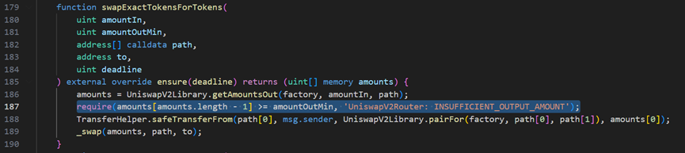
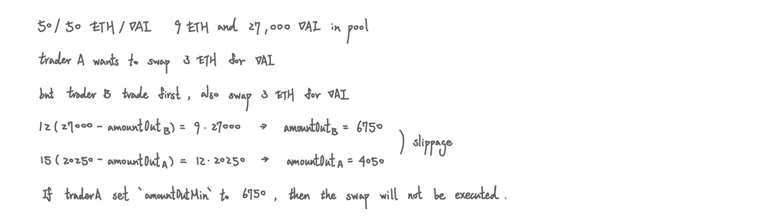
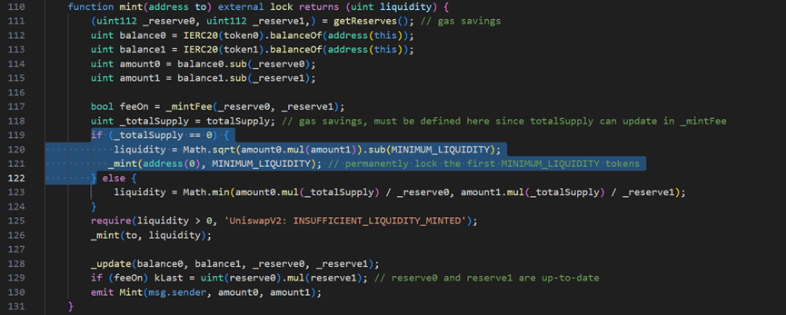
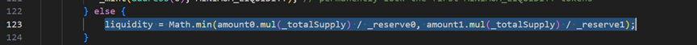
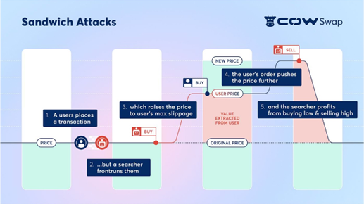

# 2024-Spring-HW2

Please complete the report problem below:

## Problem 1
Provide your profitable path, the amountIn, amountOut value for each swap, and your final reward (your tokenB balance).

> Solution
> 
> |     TokenIn    |     TokenOut    |     AmountIn    |     AmountOut    |
> |----------------|-----------------|-----------------|------------------|
> |     tokenB     |     tokenA      |     5.0000      |     5.6553       |
> |     tokenA     |     tokenD      |     5.6553      |     2.4588       |
> |     tokenD     |     tokenC      |     2.4588      |     5.0889       |
> |     tokenC     |     tokenB      |     5.0889      |     20.1299      | 
> path: tokenB->tokenA->tokenD->tokenC->tokenB, tokenB balance=20.129888944077443

## Problem 2
What is slippage in AMM, and how does Uniswap V2 address this issue? Please illustrate with a function as an example.

> Solution
> -	Slippage is the difference between the expected price and the actual price of a trade.
> -	It’s primarily caused by volatility and other factors like the size of the trade and the speed of the chain. 
> -	Slippage is unavoidable, but it can be minimized through Slippage tolerance.
> 
> -	For instance, Uniswap V2 `swapExactTokensForTokens` function would swap amountIn tokens according to the assigned `path`. Trader can set `amountOutMin`, which is the minimum amountOut the trader can accept. If amountOut at that time < amountOutMin, the trade will not be executed.
> 

## Problem 3
Please examine the mint function in the UniswapV2Pair contract. Upon initial liquidity minting, a minimum liquidity is subtracted. What is the rationale behind this design?

> Solution
> 
> To prevent front-running, ensure fair distribution, protect against impermanent loss by ensuring all liquidity providers receive a minimum share of liquidity tokens proportional to their contribution.

## Problem 4
Investigate the minting function in the UniswapV2Pair contract. When depositing tokens (not for the first time), liquidity can only be obtained using a specific formula. What is the intention behind this?

> Solution
> 
> To maintain the balance and stability of the liquidity pool. Using `min` encourage users to let the ratio be 1 to 1.

## Problem 5
What is a sandwich attack, and how might it impact you when initiating a swap?

> Solution
> 
> Sandwich attack process: The attacker monitors the transactions for large transactions about to be executed -> submit two transactions (front-run buy then sell) -> profits from buying at a low price and sell it at a high price.
The user may pay higher gas fees, slippage occurs, and buy with higher price.

reference: lecture, Fintech Intro Spring 2024 – Class 2 slide, 04/10 Midterm, online resources, ChatGPT